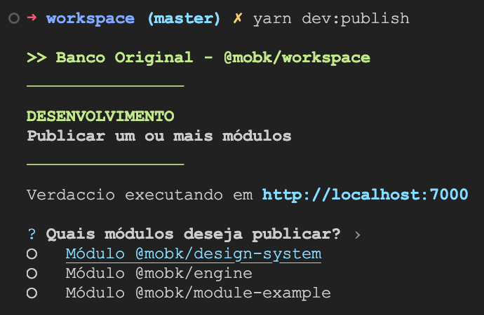
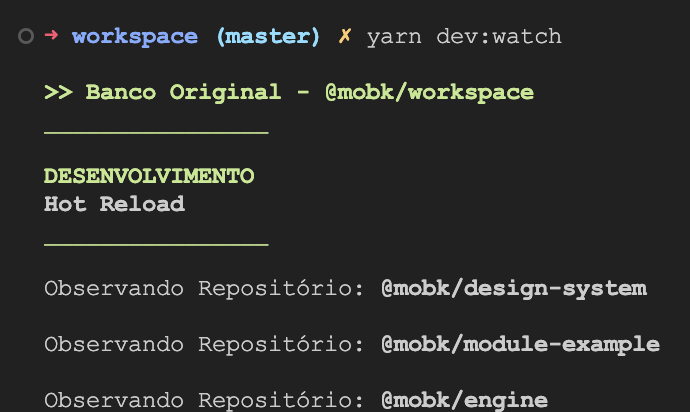
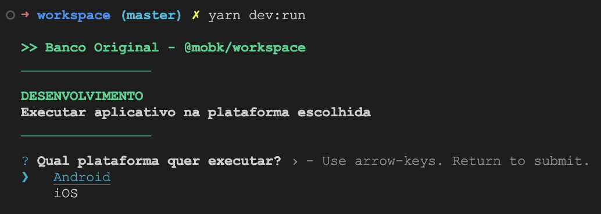
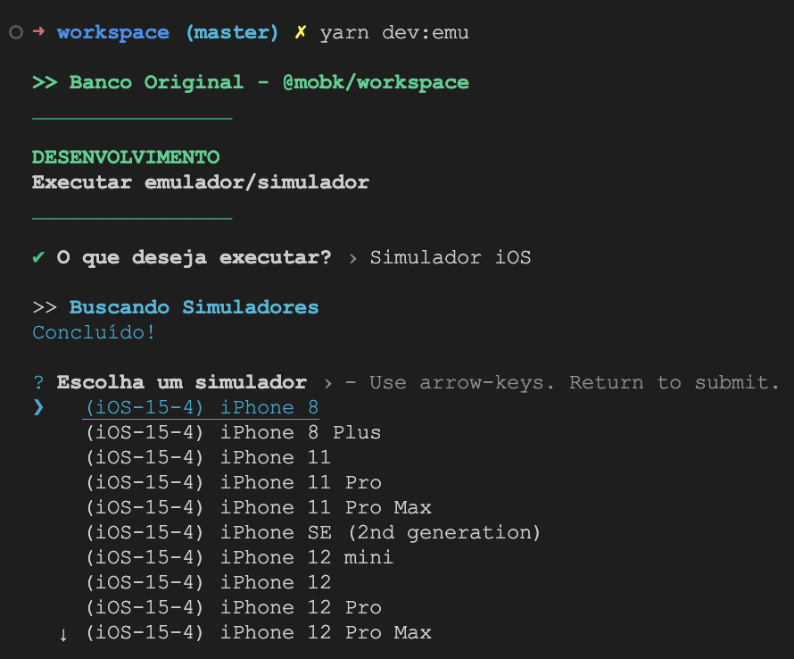
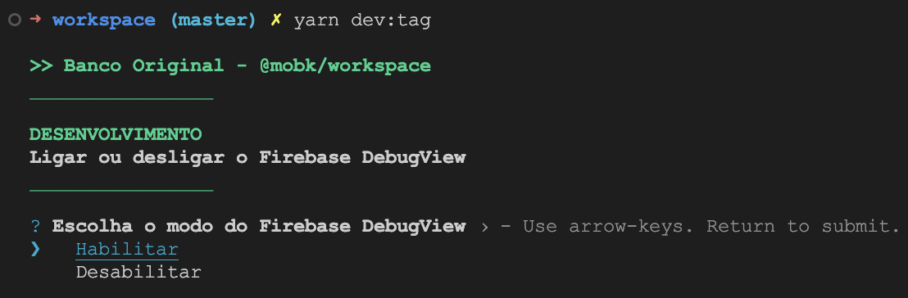

```sh
yarn dev:<comando>
```

Os comandos de Desenvolvimento devem ser executados conforme o formato acima.

O propósito desses comandos é automatizar o que for necessário para desenvolver o aplicativo.

Comandos disponíveis:

- [Desenvolvimento](#desenvolvimento)
      - [`yarn dev:publish` - Publicar Pacote(s)](#yarn-devpublish---publicar-pacotes)
      - [`yarn dev:watch` - Publicar Pacote(s) (Hot Reload)](#yarn-devwatch---publicar-pacotes-hot-reload)
      - [`yarn dev:mock` - Executar JSON Server](#yarn-devmock---executar-json-server)
- [Execução do Aplicativo](#execução-do-aplicativo)
      - [`yarn dev:run` - Executar Aplicativo](#yarn-devrun---executar-aplicativo)
      - [`yarn dev:metro` - Executar Metro](#yarn-devmetro---executar-metro)
      - [`yarn dev:emu` - Executar Emulador/Simulador](#yarn-devemu---executar-emuladorsimulador)
      - [`yarn dev:tag` - Testar Tagueamento](#yarn-devtag---testar-tagueamento)
- [Comandos Adicionais](#comandos-adicionais)
      - [`yarn dev:deploy` - Deploy de Módulo (uso interno)](#yarn-devdeploy---deploy-de-módulo-uso-interno)

---

# Desenvolvimento

#### `yarn dev:publish` - Publicar Pacote(s)



Permite a publicação de um ou mais pacotes constantemente.

Utilize as **setas do teclado** para mover o cursor, e a **barra de espaço** para adicionar/remover a seleção.

Além disso, após a publicação da nova versão local, todas as instalações daquele módulo serão atualizadas com a nova versão gerada.

#### `yarn dev:watch` - Publicar Pacote(s) (Hot Reload)



Executa automaticamente a publicação dos pacotes constantemente, como uma espécie de **Hot Reload**. A publicação ocorre exatamente igual o comando `yarn dev:publish`.

Este comando executa automaticamente, utilizando o **Chokidar** para observer as alterações, e está configurado para observar as sub-pastas `src`, `android` e `ios` de cada repositório. Para que não dispare múltiplas vezes constantemente, utilizamos o **Debounce do Lodash** para evitar execuções duplicadas, com um tempo de 1 segund (ou seja, se houverem cinco alterações dentro de 1 segundo, executará somente uma única vez).

Caso você realize uma nova alteração de arquivo enquanto uma publicação está em andamento, tal publicação será cancelada, e uma nova será iniciada. O sistema também permite que múltiplos repositórios sejam publicados ao mesmo tempo (caso você altere arquivos de mais de um repositório ao mesmo tempo), mas o _output_ fica um pouco embaralhado.

#### `yarn dev:mock` - Executar JSON Server


Iniciar um server de mocks para simular chamadas de serviço dentro de [http://localhost:8002](http://localhost:8002).

Esse server de mock utiliza o `json-server` como biblioteca para montar um banco de dados e rotas específicas simuladas.

---

# Execução do Aplicativo

#### `yarn dev:run` - Executar Aplicativo



Executar o aplicativo em uma plataforma, na variante de Homologação. Também iniciará o Packager (Metro Server) caso não tenha sido iniciado. Um proxy para o comando `yarn <plataforma>:homolog` do projeto `@mobk/main`.

Irá inicializar um Emulador ou Simulador caso não encontre um dispositivo com debugging habilitado conectado, ou um Emulador/Simulador já aberto. No caso do iOS, irá executar o aplicativo no primeiro Simulador aberto que encontrar, caso tenha algum.

#### `yarn dev:metro` - Executar Metro

Executar o o Packager (Metro Server) manualmente. Um proxy para o comando `yarn start` do projeto `@mobk/main`.

Este comando pode ser útil caso necessite da execução manual do Metro, ou para passar algum parâmetro específico (como o `--reset-cache`, por exemplo).

#### `yarn dev:emu` - Executar Emulador/Simulador



Executar um **Emulador Android** ou um **Simulador iOS**. Exibirá a seleção de plataforma, e depois a seleção do respectivo emulador ou simulador para executar.

#### `yarn dev:tag` - Testar Tagueamento



Habilitar ou desabilitar o Firebase DebugView, para testes de eventos de Analytics.

---

# Comandos Adicionais

#### `yarn dev:deploy` - Deploy de Módulo (uso interno)

Comando reservado para uso interno dos comandos `yarn dev:publish` e `yarn dev:watch`.

Padroniza a forma de deploy dos módulos quando são publicados pelos dois comandos referenciados acima.
