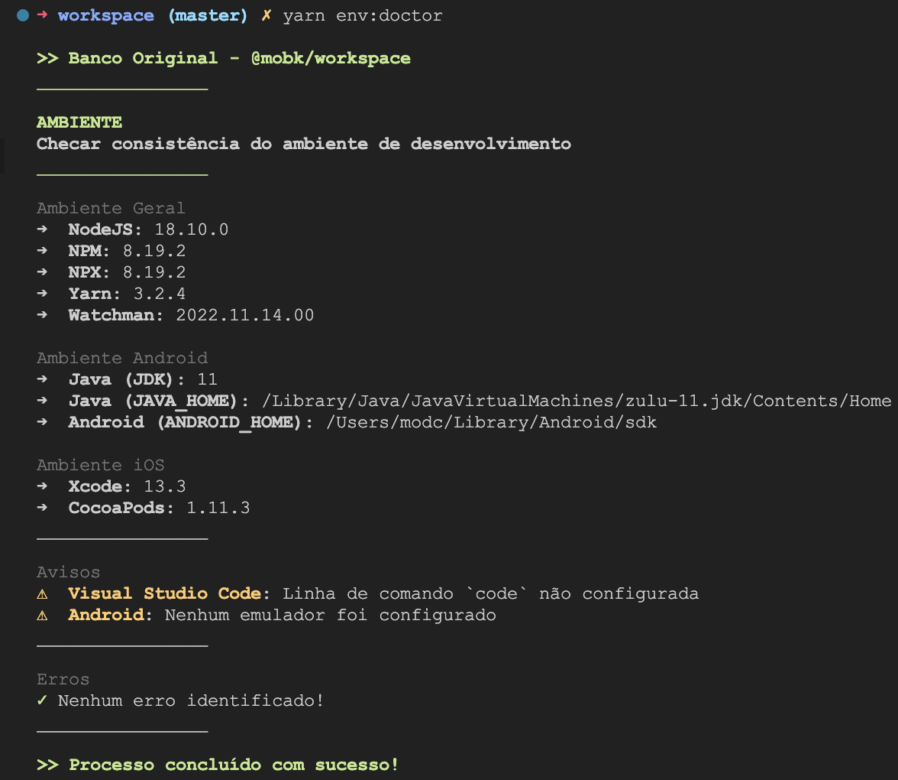

```sh
yarn env:<comando>
```

Os comandos de Ambiente devem ser executados conforme o formato acima.

O propósito desses comandos é automatizar a preparação e manipulação do ambiente de desenvolvimento.

Comandos disponíveis:

- [Preparação de Ambiente](#preparação-de-ambiente)
      - [`yarn env:init` - Inicializar Ambiente](#yarn-envinit---inicializar-ambiente)
      - [`yarn env:set` - Selecionar Ambiente](#yarn-envset---selecionar-ambiente)
- [Manutenção de Ambiente](#manutenção-de-ambiente)
      - [`yarn env:clean` - Restaurar Ambiente](#yarn-envclean---restaurar-ambiente)
      - [`yarn env:doctor` - Checar Ambiente](#yarn-envdoctor---checar-ambiente)

---

# Preparação de Ambiente

#### `yarn env:init` - Inicializar Ambiente


Iniciar o ambiente de desenvolvimento.

Isso irá executar os seguintes processos:

- Clonar todos os repositórios em `submodules/**`;

- Puxar a última versão da branch `master` de cada repositório;

- Instalar os pacotes NPM com `yarn` em cada repositório;

- Publicar os repositórios entre si;

#### `yarn env:set` - Selecionar Ambiente


Selecionar qual ambiente deseja trabalhar. Após definir o ambiente para o formato que preferir, basta seguir com os [Comando de Desenvolvimento](./dev.md) que auxiliem nas atualizações e no desenvolvimento.

Qualquer opção de desenvolvimento escolhida irá ocasionar na alteração do arquivo `src/module/ModuleDeployment.ts` dentro do `@mobk/main`. Esse arquivo é lido pelo `src/module/ModuleRegistry.ts`, e é utilizado para determinar quais rotas do aplicativo terá dentro do navegador pai da aplicação.

As opções de ambiente disponíveis são:

<!-- omit in toc -->
##### Sandbox

Irá atualizar o ambiente para um aplicativo Sandbox, para desenvolvimento de implementações pontuais, que podem ser livremente testados na tela `src/sandbox` do `@mobk/main` - útil para:

- Desenvolvimento de funcionalidades compartilhadas no `@mobk/engine`, assim é possível testá-las diretamente no `@mobk/main` antes de publicar e testar em todos os módulos;

- Desenvolvimento de componentes ou testes de tela no `@mobk/design-system`, utilizando-os em uma tela de teste diretamente no `@mobk/main`;

- Desenvolvimento somente do aplicativo `@mobk/main` e sua arquitetura, para testar alguma funcionalidade nova, procedimento de compilação, dentre outras implementações que não necessitem dos módulos integrados;

Por trás dos panos, esta opção ignora todos os módulos integrados, e gera um aplicativo com uma única tela (a já mencionada `src/sandbox`). Este arquivo não é controlado pelo Git, então você terá liberdade de alterá-lo sem qualquer problema.

<!-- omit in toc -->
##### Standalone

Irá atualizar o ambiente para um aplicativo Standalone, incluindo somente o módulo escolhido no build do `@mobk/main` - útil para:

- Desenvolvimento somente de um módulo do tipo `@mobk/module-*`, gerando um aplicativo que contenha os módulos mandatórios (Login, por exemplo) e o módulo escolhido na lista deste comando;

<!-- omit in toc -->
##### Full

Irá atualizar o ambiente para desenvolver o aplicativo completo, com todos os módulos definidos no `src/modules/ModuleRegistry.ts` do `@mobk/main` - útil para:

- Desenvolvimento ou teste do aplicativo completamente integrado, com todos os módulos, igual ao que será disponibilizado na versão produtiva da aplicação;

---

# Manutenção de Ambiente

#### `yarn env:clean` - Restaurar Ambiente


Irá restaurar o ambiente completamente, como se fosse a primeira vez que o preparou.

Isso irá garantir os seguintes contratos:

- O cache do Yarn de cada repositório será excluído, assim como sua cópia local;

- O estado do Git de cada repositório será restaurado;

- Todos os arquivos não controlados pelo Git serão completamente excluídos.

Este comando é recomendado caso encontre algum problema com o ambiente, ou deseje limpá-lo antes de iniciar uma nova demanda.

#### `yarn env:doctor` - Checar Ambiente



Irá analisar o seu ambiente, assim como as versões instaladas dos softwares necessários, e retornará um breve relatório do estado atual do seu ambiente, com os **erros** identificados. Também irá apresentar algumas sugestões como **avisos**.

Se você seguiu os passos em [Primeiros Passos >> Pré-Requisitos](../first-steps/prerequisites.md), estará com o ambiente correto.
